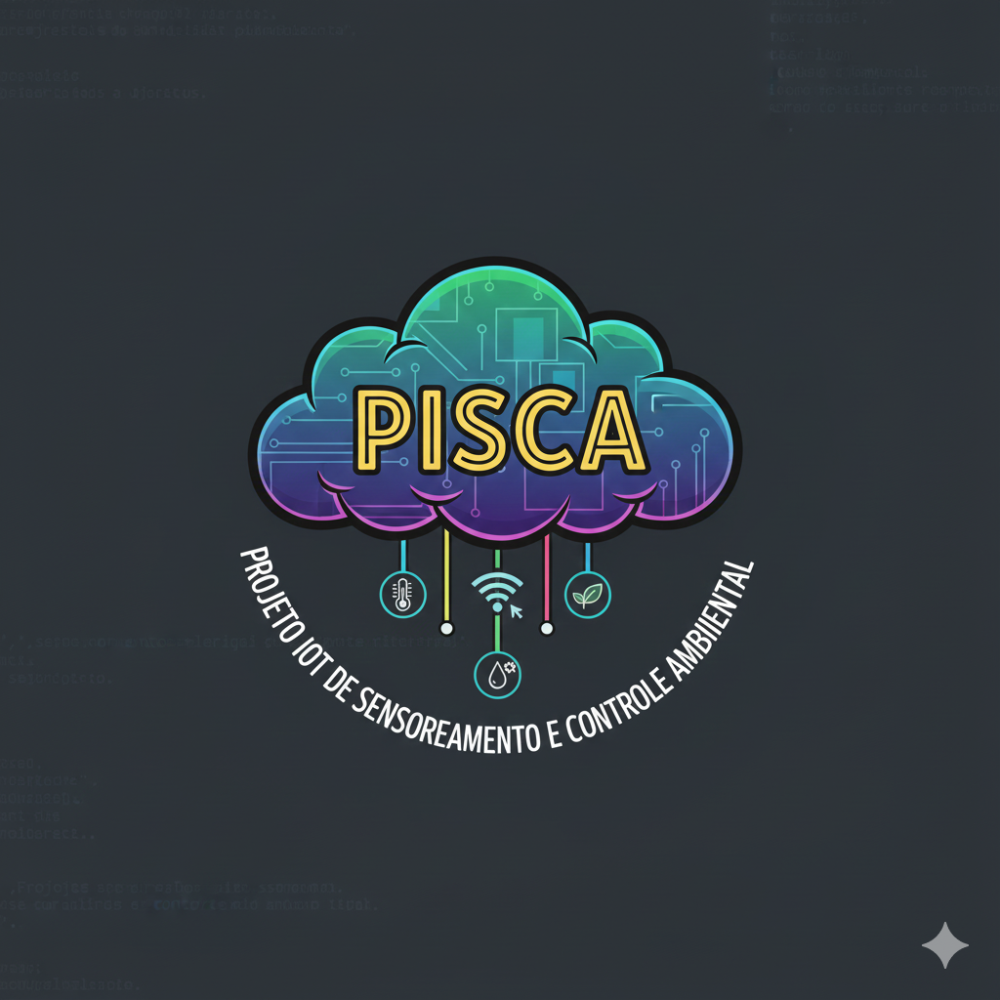

# PISCA
Projeto IoT de Sensoriamento e Controle Ambiental (PISCA)

  

Este projeto foi desenvolvido, inicialmente, como uma proposta
de selfhost. A ideia é dar as ferramentas iniciais a usuários
que sentem essa necessidade. Destacamos que uma das vantagens 
do selfhost e de projetos do estilo HomeLabbing é justamente a
autonomia e a liberdade em trabalhar, afinal pode-se personalizar
o projeto conforme as suas próprias necessidades.

Este projeto conta com as ferramentas
- [Node.js](https://nodejs.org/en), na qual o express foi usado para uma maior conveniência 
- [Arduino IDE](https://www.arduino.cc/en/software/), para programar o ESP32
